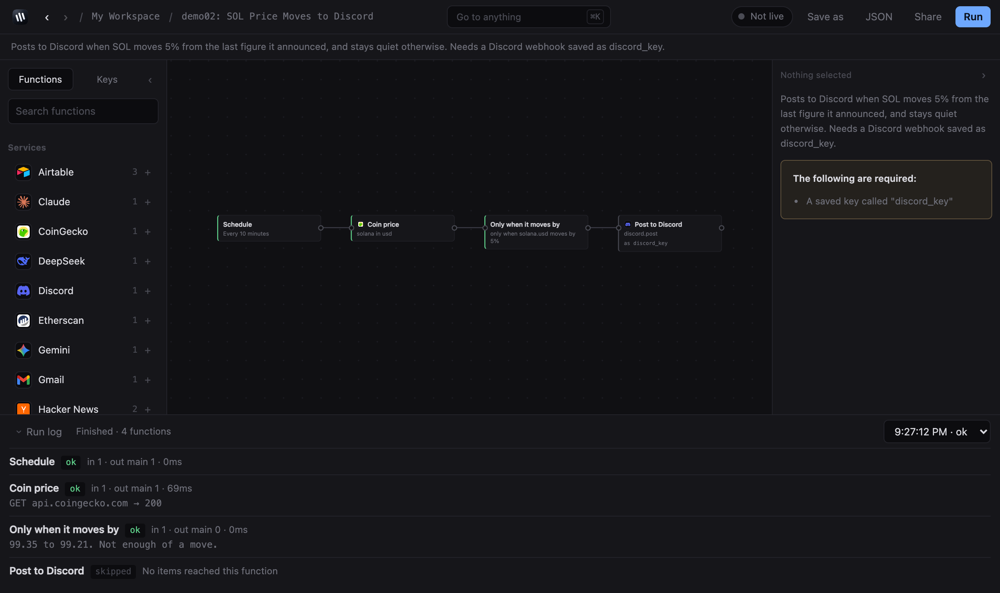
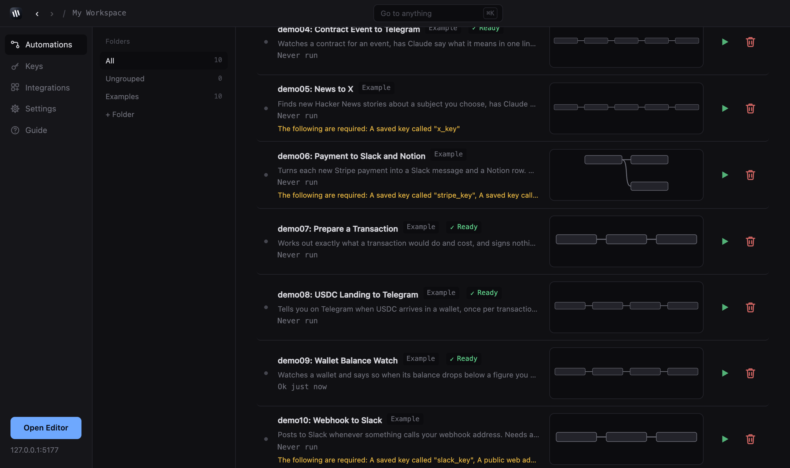
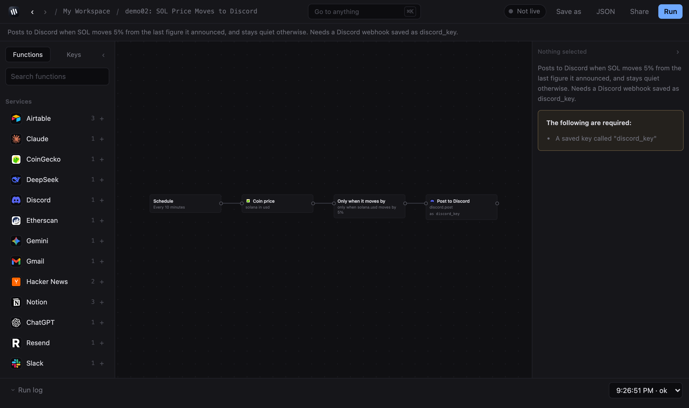

# Zorilla



Automations that run on your machine. No account, no cloud, no company in the
middle.

You wire up triggers, HTTP calls, branches and your own JavaScript on a canvas,
or describe what you want in a sentence and let an agent write it. Your API keys
are encrypted on disk and never leave. Zorilla reads Ethereum too: balances,
token amounts, contract calls, events, gas and ENS.

Node 20 or newer. No build step.

```
npx github:getzorilla/zorillaApp
```

That fetches it, starts it and opens the page. To keep a copy you can edit:

```
git clone https://github.com/getzorilla/zorillaApp
cd zorillaApp && npm install && npm start
```

It serves on http://127.0.0.1:5177 and binds to your machine only. It holds your
keys and has no login, so don't expose it. Tunnel over SSH if you need it
remotely.

## Start here

Your workspace opens with ten demos in an **Examples** group, all switched off.
Two run with no setup at all — they're tagged **Ready**.

Open **demo09: Wallet Balance Watch** and press **Run**. It reads a wallet's
balance on Ethereum, writes it to the log, and says so separately when the
balance moves. The strip along the bottom is the run log: what every step
received, what it sent, how long it took.

For one that leaves your machine, take **demo02: SOL Price Moves to Discord**.
Make a webhook in the Discord channel you want, save it under Keys as
`discord_key`, and switch the automation on.



## Have an agent build it

Press **Have an agent build it**, say what you want in your own words:

> I want an automation that checks Reddit, Discord, and the News for any new
> updates on the Robinhood Chain and posts a daily digest for me on Telegram
> and Discord

Zorilla writes a prompt around it, bundled with a reference to every step, its
parameters and what each one hands on. Paste that into Claude, ChatGPT or your
own agent, bring the JSON back with **Import**. If it uses a service you haven't
got a key for, the import screen puts the right form in front of you and you
only fill in the key.

## What it does

Some steps wait rather than act: a new Telegram message, a new Stripe payment, a
new Notion row. They check on a timer, pass on only what they haven't seen
before, and remember across restarts.

Steps that read a list keep paging until they have what you asked for, and the
log says whether anything was left behind.

Files travel with an item. Download one, build one from text, save it, attach it
to an email.

Keys live under Keys. Pick the service, fill in the fields, press **Test**. A
step that needs a key gets a dropdown of the ones that fit and applies whatever
that service wants — you never write an `Authorization` header yourself. A step
only receives the keys chosen on it, so a shared automation can't reach the rest
of your vault.

Ethereum reads work on mainnet and Sepolia. Amounts stay whole integers the
whole way and leave a step as strings, so nothing rounds. **Prepare
transaction** works out what a transaction would do, refuses anything that would
fail, and reports the fee — signing is still manual, see `docs/SIGNING.md`.



## Integrations are files, not code

An integration is JSON: the fields a service needs, how a request
authenticates, what each step sends. Nothing in it executes, so you can read
which hosts it contacts off the file before installing it.

Seventeen ship with Zorilla — Airtable, Claude, ChatGPT, CoinGecko, DeepSeek,
Discord, Etherscan, Gemini, Hacker News, Notion, Resend, Slack, Stripe,
Supabase, Telegram, Twilio and X. Gmail is built in separately, over SMTP with
an app password, because its real interface is OAuth2.

Write your own under **Integrations** — there's a prompt for that too, which
fills in the service name for you — or drop a JSON file into
`~/.zorilla/integrations/`. Two rules are enforced when one is saved:

- The host a step contacts must be written out in full. Paths can contain
  values you fill in; a host assembled at run time is refused, because nobody
  could tell what it reaches.
- A key travelling in a web address is called out on screen, because it ends up
  in logs all along the route. Some services require it, so it gets disclosed
  rather than hidden.

## Sharing

Press **Share** on an automation and you get a file naming the keys it needs,
never their values.

Going the other way, **Import** shows you what the file contacts, which of your
keys it asks for by name, and whether it runs JavaScript somebody else wrote —
all worked out by walking the graph, so none of it is the author's word for
anything. Everything arrives switched off.

## Themes

Thirteen are preloaded, including Nord, One Dark, Catppuccin, Dracula, Monokai
and Tokyo Night. Yours go in `~/.zorilla/themes/`.

## Letting Stripe or GitHub reach you

A webhook step listens on your own machine, so nothing on the internet can reach
it as it stands. Open one and press **Create address**. Zorilla fetches
Cloudflare's tunnel program the first time — about 30MB, into your Zorilla
folder — and hands you an address.

The tunnel dials outward. Nothing on your computer becomes reachable except that
one address, and it closes when you stop it. Every webhook gets a secret;
callers send it as `?secret=…` or an `X-Zorilla-Secret` header, and anything
without it is refused.

`npm run tunnel` does the same from the command line, and `ZORILLA_PUBLIC_URL`
tells the editor which address to show.

## Running it around the clock

A live automation fires only while Zorilla is running, which on a laptop means
while the lid is open. To keep one going overnight, put Zorilla on a server you
own:

```
git clone https://github.com/getzorilla/zorillaApp
cd zorillaApp
docker build -t zorilla .

docker run -d --name zorilla --restart=always --network host \
  -v zorilla-data:/data \
  -e ZORILLA_PASSPHRASE=pick-something-long-and-private \
  zorilla
```

Then reach it from your own machine with `ssh -N -L 5177:127.0.0.1:5177
you@your-server` and open <http://127.0.0.1:5177>.

`--network host` is load-bearing: the server binds `127.0.0.1` and that is not
configurable, so under host networking it binds the server's own loopback and
is reachable from that machine and nowhere else. The volume holds the vault, the
automations and the run history. `ZORILLA_PASSPHRASE` is what lets the vault
unlock without you typing it — a vault cannot be opened with a different one,
and a lost passphrase cannot be recovered.

The same instructions are in the app under Settings.

## When something fails

A step can retry a few times before it counts as broken, and can be set to stop,
carry on with the error attached, or send the failure down its own wire so you
can post it somewhere. Schedules are written to disk as they fire, so runs
missed while the machine was asleep get caught up once on the next start.

## What it can't do yet

- **Sign or send onchain.** It simulates and reports the fee. Nothing signs.
- **Loop.** Long lists page themselves, but there's no general loop.
- **Cron expressions.** Every N minutes, hours or days, or once at a set time.
- **Keep the same public address.** Every tunnel restart gives out a new one.

Two things to know about running other people's work. The **Run JavaScript**
step runs in a separate process with no file access, no way to start other
programs and an empty environment — but it can still reach the network, so treat
a shared automation that uses one as code you've chosen to run. And node files
under `~/.zorilla/nodes/` are unrestricted Node code: installing one is the same
as `npm install` on a package you haven't read.

## Licence

Elastic License 2.0. Read it, run it, change it, use it at work. The one thing
you can't do is sell it to other people as a hosted service.
